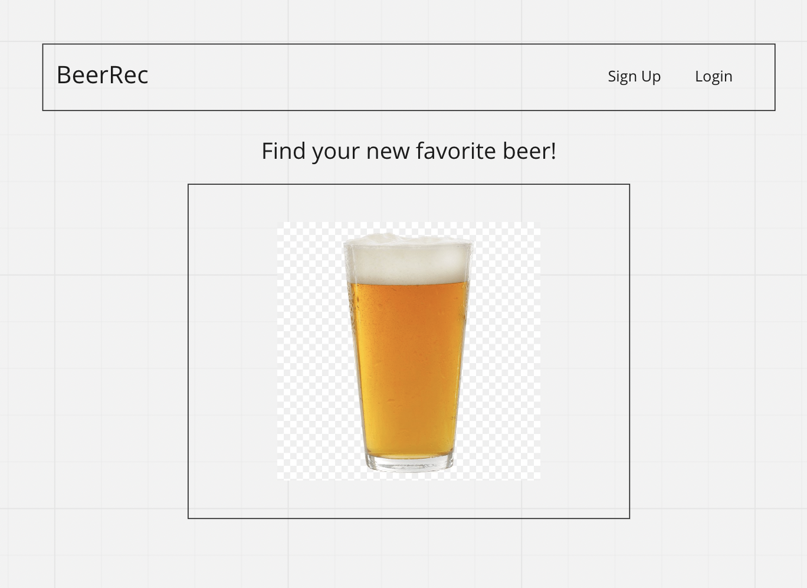
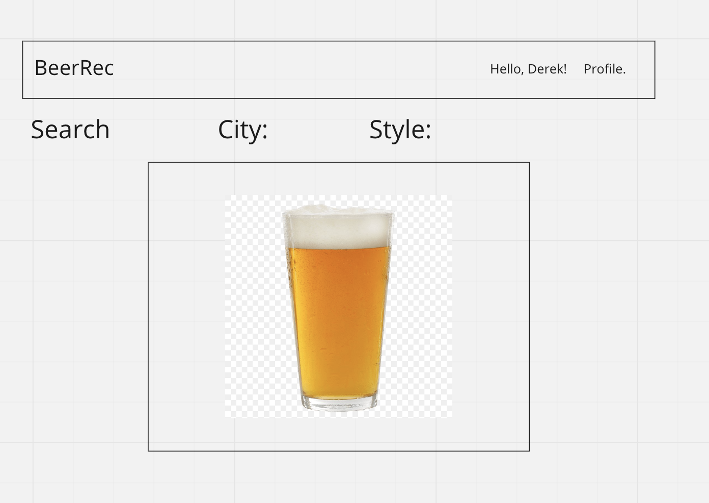
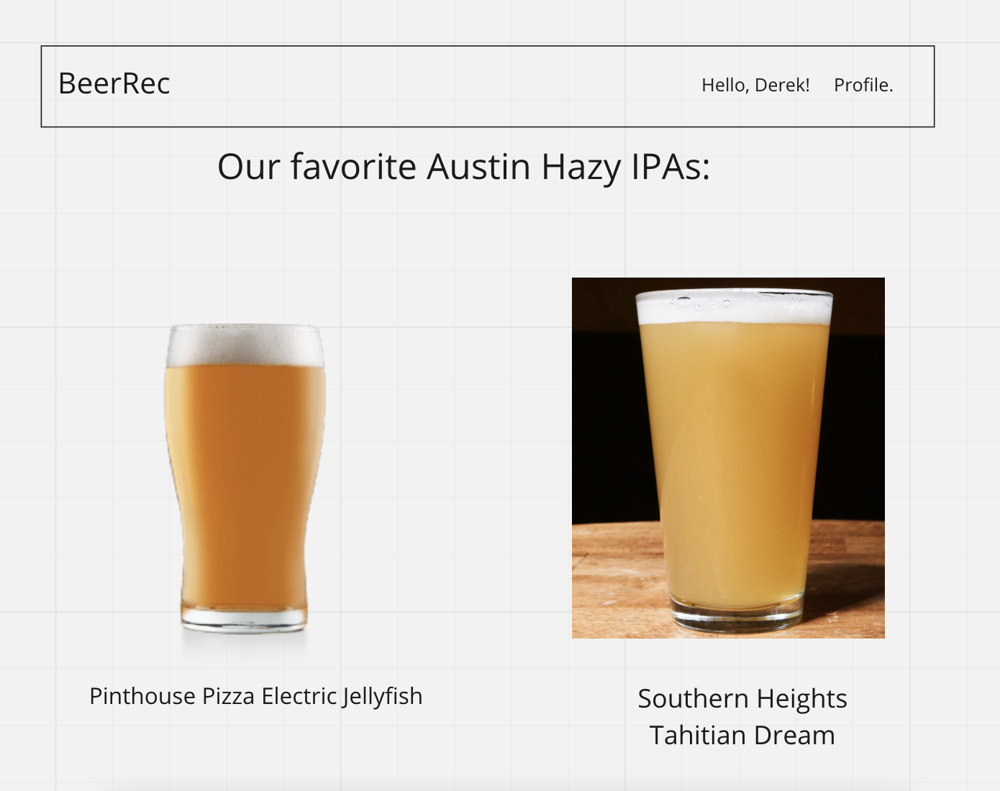
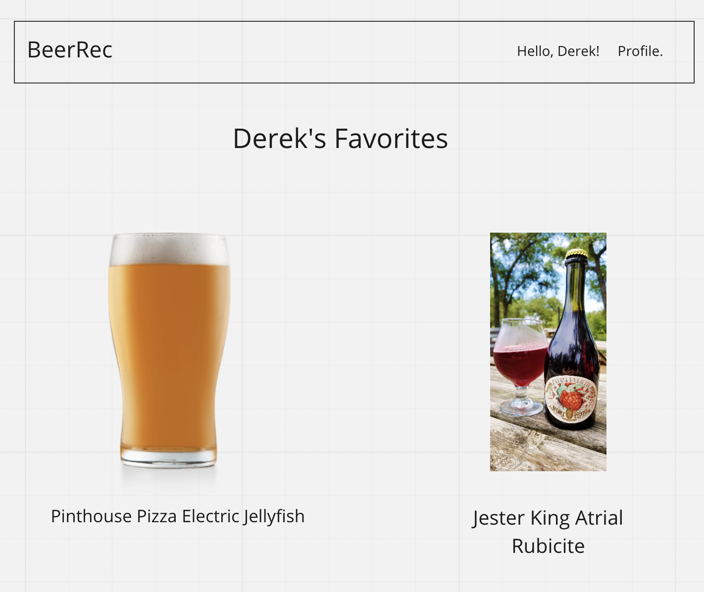

# BeerRec

## Overview

The purpose of this app is to recommend beers to users based on their location and a specific beer style of their choosing.

## Wireframes

## User Stories

- I am looking for beers in a new city, based off the types of styles I know I like from past experiences.
- I am interested in trying a new style, and have no idea where to find it.
- I can create a user account that allows me to remember my favorite beers.

## Routes Inventory

| Verb |     Path    |                Summary                |
|:----:|:-----------:|:-------------------------------------:|
|  GET |    /city    |       search for beers in a city      |  
|  GET | /city/style | search for beers of a style in a city |   
|  PUT |    /save    |     save favorite beers to profile    |  
|  PUT |    /user/   |          create user account          |   
|  PUT | /user/login |         login to user account         |  
|  PUT |  /user/save |     save favorite beers to profile    |  

## MVP Checklist

- User sign up and login
- Profile for remembering favorite beers
- Beer Search based on Style
- Beer Search based on City
- Address of brewery/brewpub

## Stretch Goals

- Beers are suggested based on highest user ratings
- Images of beer labels/bottles/cans appear for each beer
- Map of breweries in a city
- Favorite a brewery/search through a brewery's beers
- Recommendations based on favorited beers